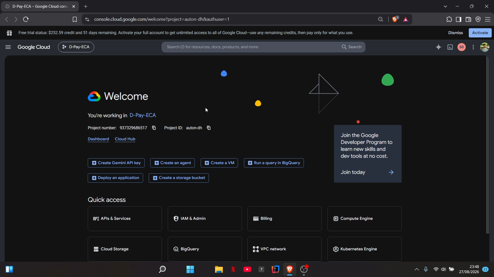

# 💳 D-Pay | Premium POS Web Frontend

[](https://nextjs.org/)
[](https://react.dev/)
[](https://www.typescriptlang.org/)
[](https://tailwindcss.com/)
[](https://axios-http.com/)
[](https://www.docker.com/)

 ---

## 🎥 Project Demonstration VIDEO & GCP Configuration VIDEO

Click the image below to watch the full project demonstration. This video showcases the execution of the D-Pay microservices and provides a detailed walkthrough of the internal configurations on Google Cloud Platform (GCP).

## 🔗 Quick Links

|                                               🎥 **Video Demo**                                                |
|:--------------------------------------------------------------------------------------------------------------:|
| [▶ Watch on Google Drive](https://drive.google.com/file/d/1NDpEqigfrObE7qfIt4ZVdgn3tiRLsIk-/view?usp=drive_link) |

[](https://drive.google.com/file/d/1NDpEqigfrObE7qfIt4ZVdgn3tiRLsIk-/view?usp=drive_link)

The **D-Pay Web Frontend** is a modern, ultra-premium Single Page Application (SPA) built for the D-Pay Point-of-Sale & Business Management System. Developed on **Next.js 16 (App Router)** and **React 19**, it communicates with backend microservices via the Spring Cloud API Gateway. The interface features a full dark-mode aesthetic, fluid animations, and a responsive sidebar layout designed for real-world retail and business environments.

---

## 🌟 Features & Pages

- **📊 Central Dashboard (`/`)**:
  - Live KPI metrics: Total users, inventory items, active orders, and revenue.
  - Interactive area chart with configurable time-period filters (7 days / 30 days / all-time).
  - Recent orders feed with order names, customer names, amounts, and statuses.
  - Low-stock alerts panel for inventory monitoring.
  - Quick-action shortcuts for instant navigation.

- **📦 Inventory Management (`/inventory`)**:
  - Product catalogue with image previews, SKU, category, price, and stock quantity.
  - Add / edit products with `multipart/form-data` image upload (GCS-backed).
  - Category-based filtering and per-product stock adjustment.
  - Form validation with Zod and React Hook Form.
  - Safe deletion with confirmation dialogs.

- **👥 User Management (`/users`)**:
  - Full user directory with role badges (Admin, Manager, Staff, Customer).
  - Register new users, update profiles, and toggle active/inactive status.
  - Delete users with confirmation modal protection.

- **🛒 Point of Sale Terminal (`/pos`)**:
  - Live product search and cart management with quantity controls.
  - Real-time subtotal / tax / total calculations.
  - Walk-in customer support — saves named customers to the User Service.
  - One-click checkout that creates an order via the Order Service.
  - Receipt/order summary on successful checkout.

- **📑 Orders Management (`/orders`)**:
  - Full order history with order ID, customer, items, amounts, and statuses.
  - Order status update workflow (`PENDING` → `PROCESSING` → `COMPLETED`).
  - Order cancellation with confirmation.
  - Date-range and status filtering.

- **⚙️ Settings (`/settings`)**:
  - Application configuration panel.

- **🎨 Layout & UI Components**:
  - Collapsible `Sidebar.tsx` with icon navigation and active-route highlighting.
  - `Header.tsx` with page title and global actions.
  - Sonner toast notifications for all async operations.
  - Dark-mode-first design using Tailwind CSS v4 and Radix UI primitives.

---

## 🛠️ Tech Stack

| Layer | Technology |
|---|---|
| **Framework** | [Next.js 16](https://nextjs.org/) (App Router) |
| **UI Library** | [React 19](https://react.dev/) |
| **Language** | [TypeScript 5](https://www.typescriptlang.org/) |
| **Styling** | [Tailwind CSS v4](https://tailwindcss.com/) |
| **Components** | [Radix UI](https://www.radix-ui.com/), [Lucide React](https://lucide.dev/) |
| **Charts** | [Recharts](https://recharts.org/) |
| **Forms & Validation** | [React Hook Form](https://react-hook-form.com/) & [Zod](https://zod.dev/) |
| **HTTP Client** | [Axios](https://axios-http.com/) |
| **Notifications** | [Sonner](https://sonner.emilkowal.ski/) |
| **Date Utilities** | [date-fns](https://date-fns.org/) |
| **Fonts** | [Inter](https://fonts.google.com/specimen/Inter) (Google Fonts) |
| **Containerisation** | [Docker](https://www.docker.com/) (multi-stage, Node 20 Alpine) |

---

## ⚙️ Environment Configuration

Create or modify `.env.local` in the `Web-app/` directory to point to your API Gateway:

```env
# Spring Cloud API Gateway Endpoint
NEXT_PUBLIC_API_BASE_URL=http://localhost:7000
```

> **Note**: For cloud or production deployments, replace `http://localhost:7000` with the public IP / domain of your API Gateway (e.g., `http://8.233.11.168:80`).

---

## 📁 Directory Structure

```text
Web-app/
├── app/
│   ├── inventory/          # Product catalogue & stock management
│   ├── orders/             # Order history, status updates & cancellations
│   ├── pos/                # Point-of-Sale terminal & checkout
│   ├── settings/           # Application settings panel
│   ├── users/              # User directory & management
│   ├── globals.css         # Tailwind CSS v4 global styles & design tokens
│   ├── layout.tsx          # Root layout: Sidebar + Header + Toaster
│   └── page.tsx            # Main dashboard (KPIs, charts, recent orders)
├── components/
│   └── layout/
│       ├── Sidebar.tsx     # Collapsible sidebar navigation
│       └── Header.tsx      # Top header bar
├── lib/
│   ├── api.ts              # Axios client & all service API calls (User, Inventory, Order)
│   └── utils.ts            # Shared utility helpers
├── types/
│   └── index.ts            # TypeScript interfaces (Student, Program, Enrollment, etc.)
├── public/                 # Static assets & favicon
├── .env.local              # Local environment variables (not committed)
├── Dockerfile              # Multi-stage Docker build (deps → builder → runner)
├── next.config.ts          # Next.js configuration
├── tsconfig.json           # TypeScript compiler options
└── package.json            # Project dependencies & npm scripts
```

---

## 🚀 Getting Started

### Prerequisites

- **Node.js** ≥ 20
- **npm** ≥ 10 (or **pnpm** for Docker builds)
- A running instance of the **D-Pay API Gateway** (Spring Cloud, default port `7000`)

### 1. Install Dependencies

```bash
cd Web-app
npm install
```

### 2. Configure Environment

```bash
# Edit the environment file
cp .env.local.example .env.local
```

Set `NEXT_PUBLIC_API_BASE_URL` to your gateway address.

### 3. Run the Development Server

```bash
npm run dev
```

Open [http://localhost:3000](http://localhost:3000) in your browser.

### 4. Build for Production

```bash
npm run build
npm start
```

---

## 🐳 Docker Deployment

The included `Dockerfile` uses a **three-stage multi-stage build** for a lean production image:

| Stage | Base | Purpose |
|---|---|---|
| `deps` | `node:20-alpine` | Install pnpm & project dependencies |
| `builder` | `node:20-alpine` | Build the Next.js application |
| `runner` | `node:20-alpine` | Serve the standalone output (non-root user) |

### Build & Run

```bash
# Build the image
docker build -t dpay-webapp .

# Run the container
docker run -p 3000:3000 \
  -e NEXT_PUBLIC_API_BASE_URL=http://<your-gateway-ip>:7000 \
  dpay-webapp
```

Open [http://localhost:3000](http://localhost:3000) in your browser.

---

## 🔌 API Services

All HTTP calls are centralized in `lib/api.ts`. The client connects to the Spring Cloud API Gateway which routes to the individual microservices:

| API Module | Base Path | Backed By |
|---|---|---|
| `userApi` | `/api/v1/users` | User Service (PostgreSQL) |
| `inventoryApi` | `/api/v1/inventory` | Inventory Service (MongoDB + GCS) |
| `orderApi` | `/api/v1/orders` | Order Service (MySQL) |
| `customerApi` | `/api/v1/users` | User Service (walk-in POS customers) |

---

## 🗄️ Backend Infrastructure (Reference)

The frontend depends on the following backend services, orchestrated via `docker-compose.yml`:

| Service | Image | Port |
|---|---|---|
| MySQL (Orders) | `mysql:8.0` | `14500` → `3306` |
| PostgreSQL (Users) | `postgres:15` | `12500` → `5432` |
| MongoDB (Inventory) | `mongo:latest` | `13500` → `27017` |

Start all databases with:

```bash
# From the FINAL-PROJECT root
docker-compose up -d
```

---

## 📜 Available Scripts

| Command | Description |
|---|---|
| `npm run dev` | Start the Next.js development server on port 3000 |
| `npm run build` | Compile and bundle for production |
| `npm start` | Run the production build |
| `npm run lint` | Run ESLint on the project |

---


## 👤 Student Information

- **Student Name:** M.K.Dilshan Hesara
- **Student Number:** 241711049
- **GCP Project ID:** auton-dh
- **Slack Handle:** https://ijse-eca-hdse-71-72.slack.com/team/U0BHGQU16F2